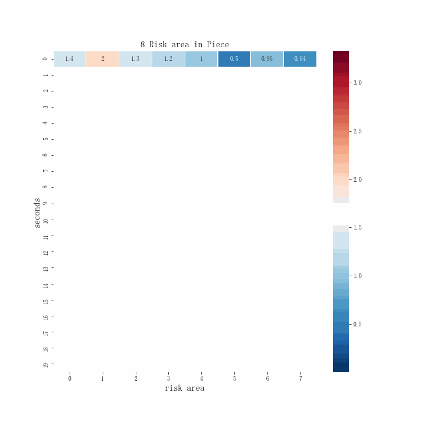

# Heatmap

## heatmap_animation.py

制作heatmap动图，核心就是利用sns.heatmap中的`mask`参数，一步一步屏蔽原始图片就可以了
```
ax1 = fig.add_subplot(111)
mask = np.ones_like(sub_risk_numpy)
sns.heatmap(sub_risk_numpy, linewidths=0.05, mask=mask, ax=ax1, cmap='RdBu_r', annot=True)
```

得到以下结果：
